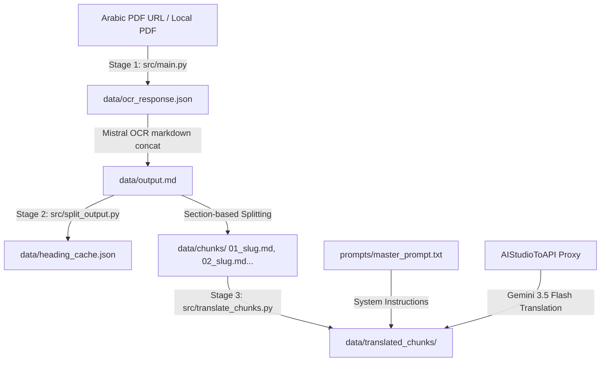

# 📖 Al-Da' wa al-Dawa' OCR & Translation Pipeline

A specialized, three-stage processing pipeline built to ingest classical Arabic book PDFs, extract high-quality markdown via Mistral OCR, split the text into balanced logical chapters, and translate the content into Malayalam optimized specifically for Text-to-Speech (TTS) narration (e.g., via Google Docs TTS).

This pipeline is pre-configured and optimized for the classical Islamic text **"Al-Da' wa al-Dawa'"** (The Disease and the Cure, also known as *"Al-Jawab al-Kafi"*) by Imam Ibn Qayyim al-Jawziyyah.

---

## 🏗️ Architecture & Pipeline Workflow

The pipeline is split into three decoupled, sequential stages to ensure resume-ability, error isolation, and customization:



### 1. OCR Extraction (`src/main.py`)
* **API:** Uses the **Mistral OCR API** (`mistral-ocr-latest`) to ingest a document URL or PDF.
* **Outputs:** 
  - `data/ocr_response.json`: The complete raw JSON metadata returned by the API (useful for page coordinates, confidence scores, and debugging).
  - `data/output.md`: A unified Markdown document concatenating all document pages, sorted by page index, with page separators (`<!-- Page X -->`).

### 2. Logical Heading-Based Splitting (`src/split_output.py`)
* **Problem:** Splitting strictly by word limits or page count cuts sentences mid-stream and orphans footnotes.
* **Solution:** Uses a **logical section-based splitting strategy**:
  1. **Heading Detection:** Detects standard Markdown headings (`#`, `##`, `###`) and generic Arabic chapter markers (e.g., `فصل`, `باب`).
  2. **Cohesive Segmenting:** Partitions the document into natural, self-contained sections.
  3. **Balanced Grouping:** Groups consecutive sections using a greedy algorithm to form chunks close to the target size (default: 10,000 words).
  4. **Malayalam Slugs:** Calls the local API proxy (or uses a fallback local dictionary) to translate headings or analyze the first 1,500 characters of a chunk, generating a descriptive Malayalam slug for chunk filenames (e.g., `01_തുടക്കം.md`).
  5. **Caching:** Heading translations are cached in `data/heading_cache.json` using MD5 hashes of the content snippet to prevent redundant API calls.

### 3. Parallel Translation Engine (`src/translate_chunks.py`)
* **Master Instructions (`prompts/master_prompt.txt`):** Governs the translation, including cleaning OCR noise, transliterating Arabic texts (Hadiths, Quranic verses, prayers) to Malayalam script for TTS phonetics, and mapping corrupt names.
* **Concurrent Execution:** Uses thread pools to translate multiple chunks concurrently (default: 3 workers, config via `TRANSLATE_WORKERS`).
* **Thinking-Level Fallback:** Integrates with the `AIStudioToAPI` proxy using **Gemini 3.5 Flash** models, automatically falling back to lower thinking levels if API limits or errors occur:
  `gemini-3.5-flash-high` ➔ `gemini-3.5-flash-medium` ➔ `gemini-3.5-flash-low` ➔ `gemini-3.5-flash-minimal`
* **Resume-ability:** Skips already translated chunks if the destination file exists and is non-empty, enabling seamless recovery from failures.

---

## 🚀 Setup & Installation

### Prerequisites
* Python >= 3.14
* [uv](https://github.com/astral-sh/uv) (recommended) or `pip`
* A running [AIStudioToAPI](file:///Users/firozahmed/Desktop/AIStudioToAPI) proxy on localhost (default: port `7860`).

### Installation
If using **uv**:
```bash
uv sync
```

Otherwise, install using pip:
```bash
pip install .
```

### Environment Configuration
1. Create or verify `.env` in this directory:
   ```ini
   MISTRAL_API_KEY=your_mistral_api_key_here
   ```
2. The pipeline reads the API keys and port settings from the AIStudioToAPI proxy environment file at `~/Desktop/AIStudioToAPI/.env`.

---

## 📖 CLI Usage Guide

### Stage 1: Document OCR Extraction
Run `src/main.py` passing the document URL. If omitted, it defaults to a pre-defined PDF on Archive.org.

```bash
# Run with default book PDF
python src/main.py

# Run with a custom PDF URL
python src/main.py "https://example.com/some_book.pdf"
```

### Stage 2: Section Splitting & Slug Generation
Partition the compiled markdown file `data/output.md` into balanced chunks:

```bash
python src/split_output.py \
  --input data/output.md \
  --output-dir data/chunks \
  --target-words 10000 \
  --heading-keywords فصل chapter section part باب അദ്ധ്യായം ഫസൽ
```
* **`--input`** / **`-i`**: Path to the source Markdown document (default: `data/output.md`).
* **`--output-dir`** / **`-o`**: Directory to save the chunk files (default: `data/chunks`).
* **`--target-words`** / **`-w`**: Target word count per chunk (default: `10000`).
* **`--heading-keywords`**: Custom words signifying headings.

### Stage 3: Batch Parallel Translation
Translate the chunks in the `data/chunks/` folder using the master translation prompt:

```bash
# Run translation (uses 3 parallel workers by default)
python src/translate_chunks.py

# Run translation with customized concurrency limits
TRANSLATE_WORKERS=5 python src/translate_chunks.py
```

---

## 📁 Directory Structure & File Index

* **[src/main.py](file:///Users/firozahmed/Desktop/transcribe/src/main.py)**: Initiates Mistral OCR, parses response pages, and generates `data/output.md`.
* **[src/split_output.py](file:///Users/firozahmed/Desktop/transcribe/src/split_output.py)**: Performs heading-based document segmenting, slug translation, and caching.
* **[src/translate_chunks.py](file:///Users/firozahmed/Desktop/transcribe/src/translate_chunks.py)**: Orchestrates concurrent translation requests with thinking-level fallback.
* **[prompts/master_prompt.txt](file:///Users/firozahmed/Desktop/transcribe/prompts/master_prompt.txt)**: Contains the system instructions, guidelines, vocabulary corrections, and translation constraints.
* **[data/heading_cache.json](file:///Users/firozahmed/Desktop/transcribe/data/heading_cache.json)**: JSON dictionary caching Arabic-to-Malayalam heading translations to minimize LLM usage.
* **[pyproject.toml](file:///Users/firozahmed/Desktop/transcribe/pyproject.toml)**: Project packaging details and dependencies.
* **`data/chunks/`**: Directory containing the generated section-based markdown chunk files.
* **`data/translated_chunks/`**: Output directory for translated Malayalam markdown files.

---

## 🛡️ License

This project is configured for private use. All source documents and translated materials are subject to their respective authors and copyright holders.
